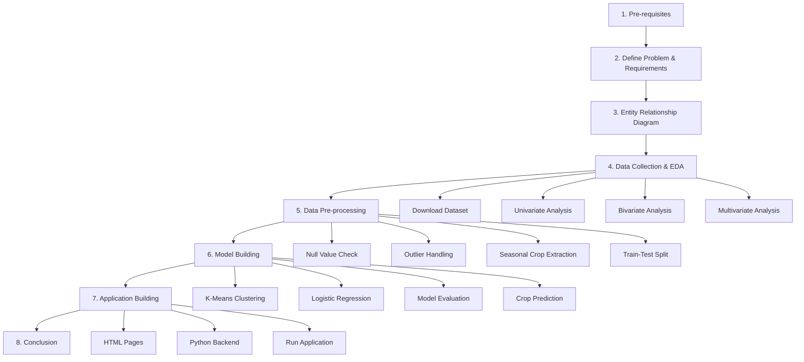

# Workflow

---

## Project Overview

**OptiCrop** is a Smart Agricultural Production Optimization Engine that uses machine learning to recommend the best crops based on soil nutrients and environmental conditions.

## End-to-End Project Flow



## Application Scenarios

| Scenario | User | Flow |
|----------|------|------|
| **Scenario 1** | Farmer | Enter soil/climate data → ML recommends best crop |
| **Scenario 2** | Farmer | Select a crop → System assesses suitability score |
| **Scenario 3** | Researcher / Policy maker | Explore analytics, NPK patterns, sustainability insights |

## ML Pipeline Flow

```
Raw CSV Data
    ↓
Load & Clean (nulls, outliers)
    ↓
Exploratory Data Analysis (uni/bi/multivariate)
    ↓
Feature Scaling (StandardScaler)
    ↓
Train-Test Split (80/20)
    ↓
Model Comparison (KNN, LR, DT, RF, K-Means)
    ↓
Select Best Model → Save .pkl artifacts
    ↓
Flask API serves predictions via web UI
```

## Web Application Pages

| Page | Route | Purpose |
|------|-------|---------|
| Home | `/` | Landing page |
| Dashboard | `/dashboard` | Stats overview |
| Crop Recommendation | `/recommend` | Scenario 1 |
| Suitability Check | `/suitability` | Scenario 2 |
| Crop Catalog | `/crops` | Browse 22 crops |
| Seasonal Crops | `/seasonal` | Kharif / Rabi / Zaid crops |
| Research Hub | `/research` | Scenario 3 analytics |
| About | `/about` | Project info |
| How It Works | `/how-it-works` | ML pipeline explanation |

## Execution Order

1. Complete pre-requisites and install dependencies
2. Review business problem and ERD
3. Run Epic 2 analysis scripts (folder `5.Epic 2 - Data Collection and Analysis/`)
4. Run Epic 3 preprocessing scripts (folder `6.Epic 3 - Data Pre-processing/`)
5. Train models: `python train_model.py`
6. Launch app: `python app.py` → open `http://localhost:5000`
