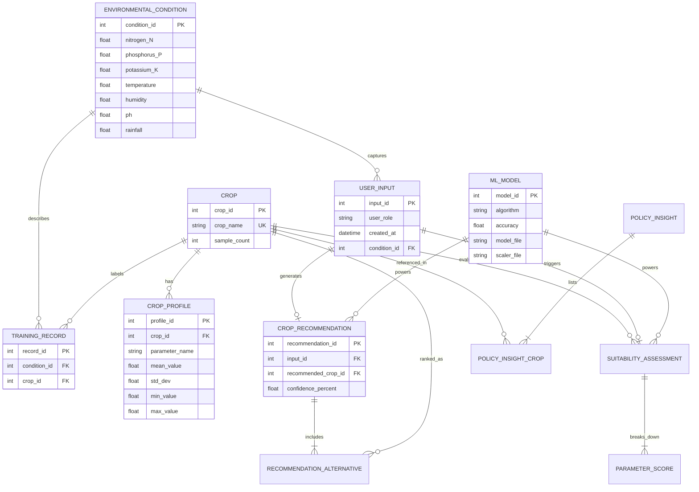

# Entity Relationship Diagram

---

## OptiCrop — Entity Relationship Diagram

Logical data model for the Smart Agricultural Production Optimization Engine.

---

## Conceptual ERD

---

## Entity Descriptions

| Entity | Description |
|--------|-------------|
| **ENVIRONMENTAL_CONDITION** | Soil NPK, pH, temperature, humidity, and rainfall values |
| **CROP** | One of 22 supported crop types (rice, maize, cotton, etc.) |
| **TRAINING_RECORD** | A labeled row from the 2,200-sample dataset |
| **CROP_PROFILE** | Statistical ranges (mean, min, max) per crop per parameter |
| **USER_INPUT** | Farmer, researcher, or policymaker field data submission |
| **CROP_RECOMMENDATION** | Scenario 1 output — best crop with confidence |
| **SUITABILITY_ASSESSMENT** | Scenario 2 output — compatibility report for a chosen crop |
| **ML_MODEL** | Trained classifier + StandardScaler saved as `.pkl` files |

---

## Mapping to Project Files

| ERD Entity | Implementation |
|------------|----------------|
| TRAINING_RECORD | `data/Crop_recommendation.csv` |
| CROP_PROFILE | `models/crop_profiles.pkl` |
| ML_MODEL | `models/crop_model.pkl`, `scaler.pkl`, `label_encoder.pkl` |
| USER_INPUT | Flask API request body (`/api/recommend`, `/api/suitability`) |
| CROP_RECOMMENDATION | `utils/model_service.recommend_crops()` |
| SUITABILITY_ASSESSMENT | `utils/model_service.assess_crop_suitability()` |
